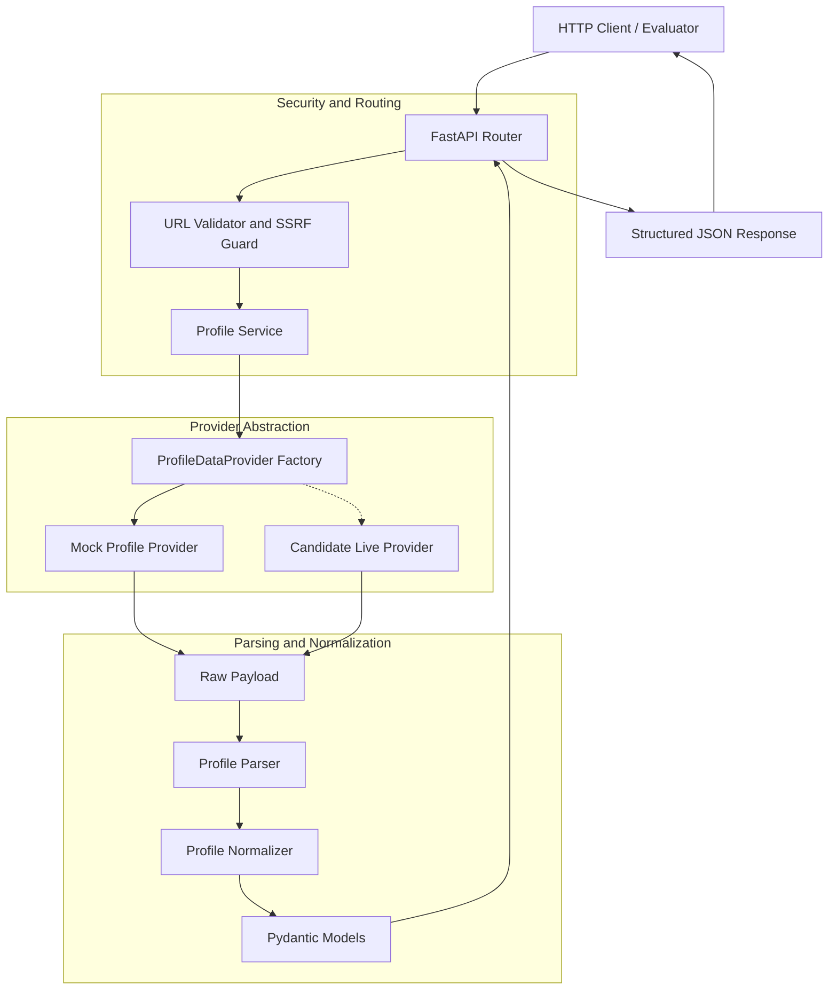

# Tross LinkedIn Profile API

A production-grade, modular REST API built with **FastAPI**, **Pydantic v2**, and **HTTPX** that accepts a LinkedIn profile URL, retrieves profile data via an isolated provider layer, and returns comprehensive structured JSON with rich metadata.

> **Engineering Note**: The direct HTTP provider is implemented using `httpx.AsyncClient` (strictly avoiding browser automation), while empirical testing demonstrated that LinkedIn's current gateway/authentication behavior prevents reliable unauthenticated or static-session retrieval. The application therefore defaults to a deterministic mock provider (`DATA_PROVIDER=mock`) while preserving the isolated direct HTTP provider and thoroughly documenting the investigation.

---

## Key Features

- **FastAPI Core**: Asynchronous, high-throughput REST API with interactive Swagger docs at `/docs`.
- **Mock-First Architecture**: Runs fully self-contained using `DATA_PROVIDER=mock` with deterministic, realistic synthetic test personas—no credentials or live network access required for development, CI, or evaluation.
- **Provider Abstraction (`ProfileDataProvider`)**: Decouples data retrieval from validation, parsing, domain models, and routing, allowing future live retrieval mechanisms to be swapped seamlessly.
- **Strict SSRF & URL Validation**: Restricts input strictly to legitimate LinkedIn profile URLs (`/in/<vanity_id>`), rejecting non-LinkedIn domains, IP addresses, localhost, and internal cloud metadata endpoints.
- **Comprehensive Profile Normalization**: Maps Profile Info, Experience, Education, Skills, Certifications, Languages, and calculates section presence metadata (`sections_found`, `sections_missing`, `warnings`).
- **Standardized Error Handling**: Predictable error responses with machine-readable error codes (`INVALID_URL`, `PROFILE_NOT_FOUND`, `RATE_LIMITED`, `PROVIDER_UNAVAILABLE`).
- **Security by Design**: Automated sensitive header/cookie sanitization in logs, `.env` excluded from Git, and zero credential leakage.
- **Containerized**: Production-ready multi-stage Docker build running under a non-root user.

---

## System Architecture



For full details, see [`docs/architecture.md`](docs/architecture.md).

---

## API Specification

### Endpoints

| Method | Endpoint | Description |
| :--- | :--- | :--- |
| `GET` | `/health` | Application health and active provider status |
| `POST` | `/v1/profile` | Accepts a LinkedIn URL and returns structured profile JSON |
| `GET` | `/docs` | Interactive OpenAPI / Swagger UI |
| `GET` | `/redoc` | Interactive ReDoc documentation |

---

### Sample Request

```http
POST /v1/profile HTTP/1.1
Host: localhost:8000
Content-Type: application/json

{
  "url": "https://www.linkedin.com/in/alex-morgan-dev"
}
```

### Sample Response (`200 OK`)

```json
{
  "status": "success",
  "data": {
    "profile": {
      "public_id": "alex-morgan-dev",
      "urn": "urn:li:synthetic_profile:1001",
      "first_name": "Alex",
      "last_name": "Morgan",
      "full_name": "Alex Morgan",
      "headline": "Lead Platform Engineer & Distributed Systems Architect",
      "location": {
        "city": "Austin",
        "state": "Texas",
        "country": "United States",
        "raw": "Austin, Texas, United States"
      },
      "about": "Passionate backend engineer with 8+ years experience architecting scalable distributed microservices...",
      "profile_picture_url": null,
      "background_picture_url": null,
      "profile_url": "https://www.linkedin.com/in/alex-morgan-dev"
    },
    "experience": [
      {
        "title": "Lead Platform Engineer",
        "company": "Acme Cloud Infrastructure Corp",
        "company_urn": "urn:li:synthetic_company:2001",
        "location": "Austin, TX",
        "start_date": { "year": 2022, "month": 3 },
        "end_date": null,
        "is_current": true,
        "description": "Leading architecture for high-throughput event ingestion pipelines...",
        "employment_type": "Full-time"
      }
    ],
    "education": [
      {
        "school": "University of Texas at Austin",
        "school_urn": "urn:li:synthetic_school:3001",
        "degree": "Bachelor of Science",
        "field_of_study": "Computer Science",
        "start_year": 2015,
        "end_year": 2019,
        "description": "Graduated Magna Cum Laude.",
        "activities": "Association for Computing Machinery (ACM)"
      }
    ],
    "skills": [
      { "name": "Python", "endorsement_count": 48 },
      { "name": "FastAPI", "endorsement_count": 39 },
      { "name": "Docker", "endorsement_count": 27 }
    ],
    "certifications": [
      {
        "name": "Certified Solutions Architect - Professional",
        "authority": "Cloud Certification Authority",
        "license_number": "CCA-PRO-984712",
        "url": "https://credentials.synthetic-example.org/verify/984712",
        "start_date": { "year": 2021, "month": 8 },
        "end_date": { "year": 2024, "month": 8 }
      }
    ],
    "languages": [
      { "name": "English", "proficiency": "NATIVE_OR_BILINGUAL" },
      { "name": "Spanish", "proficiency": "PROFESSIONAL_WORKING" }
    ],
    "metadata": {
      "fetched_at": "2026-08-27T10:30:00Z",
      "provider": "mock",
      "sections_found": ["profile", "experience", "education", "skills", "certifications", "languages"],
      "sections_missing": [],
      "warnings": []
    }
  }
}
```

---

## Important Distinction of APIs & Mechanisms

To understand this project and its context:

1. **Official LinkedIn API**: The official developer API (via Developer Portal) provides OAuth 2.0 endpoints such as `/v2/userinfo` (`r_liteprofile`), returning only the authenticated user's basic name and email. Access to full profile data across arbitrary members is restricted strictly to enterprise partners.
2. **Candidate Internal/Web Application Mechanisms**: LinkedIn's web SPA communicates with internal REST/Voyager endpoints. As documented in [`docs/research.md`](docs/research.md), this mechanism is isolated behind a provider interface and treated as a research hypothesis.
3. **Our Public API**: The API implemented here (`POST /v1/profile`) provides a unified, sanitized, and typed REST interface for clients, isolating upstream retrieval details from downstream consumers.
4. **Known Limitations & Compliance**:
   - The system does not implement CAPTCHA solvers, bot-evasion proxies, or authentication-bypassing mechanisms.
   - Profile availability is subject to privacy settings and public visibility rules.

---

## Local Setup & Development

### 1. Prerequisites
- Python 3.11+
- Git

### 2. Installation
```bash
git clone <repository-url>
cd tross-linkedin-profile-api

# Create virtual environment
python -m venv .venv
# On Windows:
.venv\Scripts\activate
# On Linux/macOS:
source .venv/bin/activate

# Install dependencies
pip install -r requirements.txt
pip install -r requirements-dev.txt
```

### 3. Running Locally (Mock Mode)
```bash
# Start server with uvicorn
uvicorn app.main:app --host 0.0.0.0 --port 8000 --reload
```
Open [http://localhost:8000/docs](http://localhost:8000/docs) to view interactive Swagger documentation.

---

## Running the Test Suite

```bash
python -m pytest -v
```

All 52 unit and integration tests run entirely in offline mock mode with isolated HTTP transports.

---

## Docker Container

```bash
# Build the Docker image
docker build -t tross-linkedin-api .

# Run the container
docker run -p 8000:8000 --env DATA_PROVIDER=mock tross-linkedin-api
```

---

## Synthetic Personas for Testing

| Vanity ID | Description |
| :--- | :--- |
| `alex-morgan-dev` | Complete profile with all sections (Experience, Education, Skills, Certifications, Languages) |
| `jordan-lee-tech` | Partial profile (missing certifications and languages) |
| `sam-taylor-ai` | Minimal profile (Profile info and skills only) |
| `not-found-user` | Triggers a 404 `PROFILE_NOT_FOUND` error |
| *(Any other valid vanity ID)* | Dynamically generates a valid synthetic developer profile |
